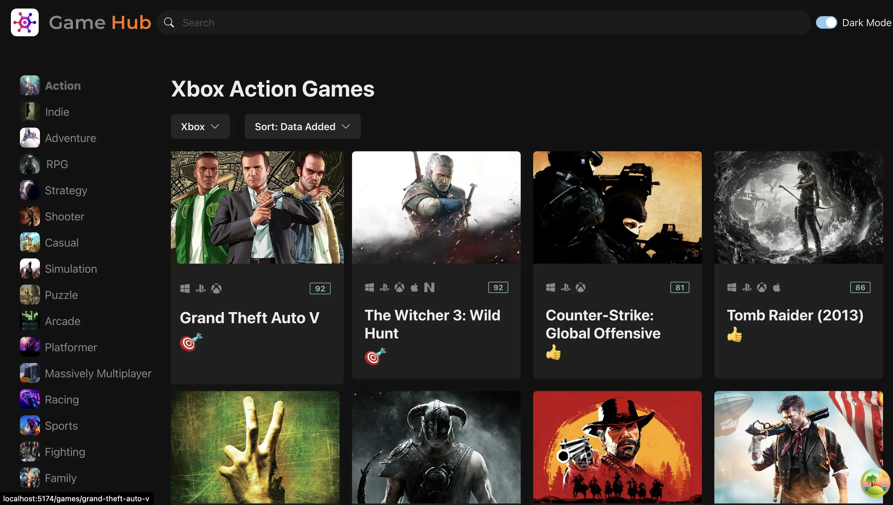
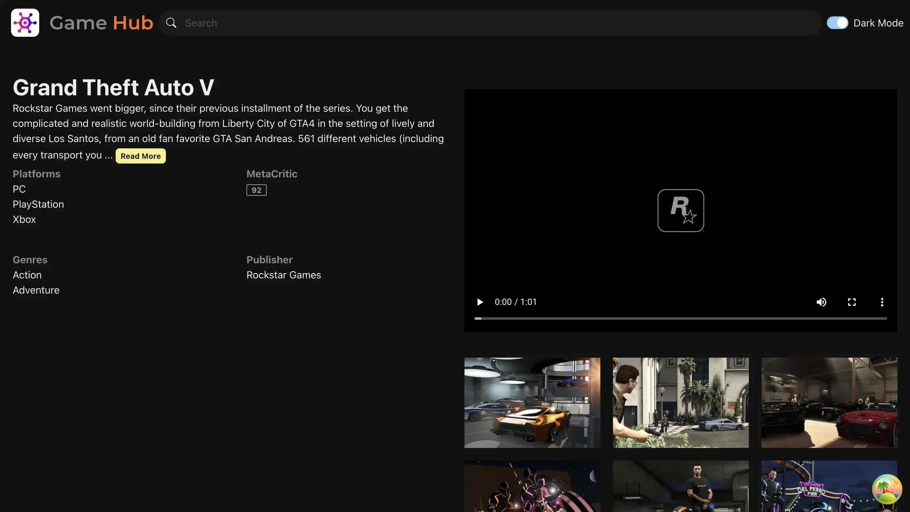

# Game Hub

- A video game listing website. A video game database and game discovery service.

* Deployed Live : <a href="https://videogameshub.netlify.app/" target="_blank">GameHub</a>

 
 

---

## Concepts, Tools Used.

- React Query for Caching.
- Zustand State Management.
- Typescript.
- Dark Mode.
- Infinite Scrolling.
- Routing.
- SOLID Coding principles.
- Custom Hooks.
- Chakra UI.
- Optimize images to reduce load time.
- Reusable Services.
- Single Responsibility / Separation of concerns for Components.

## Local Setup

- Clone the repo

`git clone https://github.com/adithya61/gamehub`

- cd to directory.

` cd gamehub`

- Install dependencies.

` npm install`

- Run the app.
  `npm run dev`

then press 'o' to open in browser.
